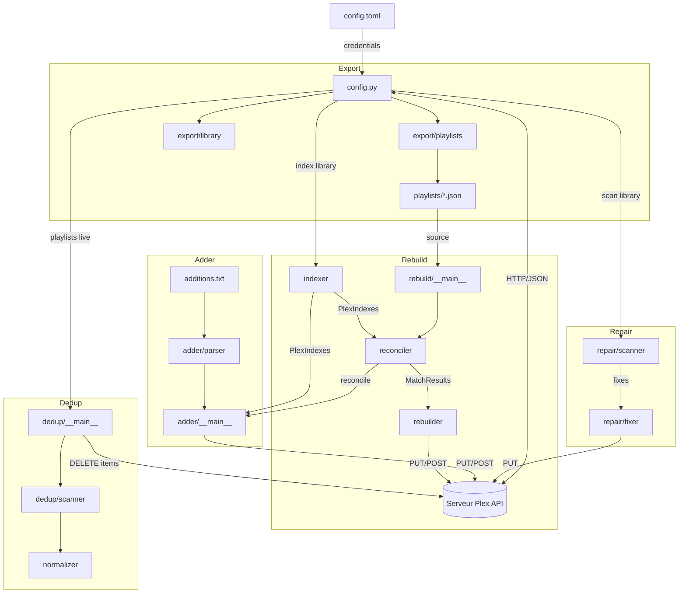

# Architecture — plex-tools

## Quoi et pourquoi

Suite d'outils CLI pour gérer une bibliothèque musicale Plex : exporter des données, reconstruire des playlists après un reset de BDD, réparer des métadonnées manquantes, détecter des doublons et ajouter des tracks depuis des listes texte. Chaque outil opère en lecture seule par défaut (dry-run) et ne mute qu'avec `--execute`.

## Ordre de lecture

Pour comprendre le système :

1. `config.py` — le socle partagé (credentials, helpers HTTP, résolution playlist, création/ajout playlist)
2. `rebuild/indexer.py` → `rebuild/reconciler.py` — le moteur central (indexation + matching en cascade)
3. `rebuild/__main__.py` — comment le pipeline s'orchestre
4. `dedup/normalizer.py` → `dedup/scanner.py` — normalisation version-stripped et analyse de doublons (dont sélection par bitrate)
5. Les autres modules suivent le même pattern : scan → action → report

## Composants

| Module | Responsabilité |
|--------|---------------|
| `config.py` | Credentials TOML, headers Plex, résolution playlist, normalisation texte, helpers d'écriture Plex (create/add/URI) |
| `export/playlists` | Exporte les playlists live en JSON (un fichier par playlist) |
| `export/library` | Exporte la config des bibliothèques (sections, types) |
| `export/download` | Télécharge les fichiers audio depuis Mega via `megadownload` CLI |
| `rebuild/indexer` | Scanne toutes les tracks via API HTTP, construit 4 index de réconciliation |
| `rebuild/reconciler` | Cascade de matching GUID → filepath → filename → metadata → fuzzy |
| `rebuild/rebuilder` | Crée/complète les playlists via API HTTP (incrémental) |
| `rebuild/report` | Rapports console + JSON + CSV non-résolus |
| `repair/scanner` | Détecte les métadonnées manquantes (title vide, index absent) |
| `repair/fixer` | Applique les corrections via PUT API Plex (throttle + retry) |
| `repair/report` | Rapports pré/post-exécution |
| `dedup/normalizer` | Normalisation version-stripped (retire remasters, mixes, éditions) |
| `dedup/scanner` | 4 analyses + sélection par bitrate (_pick_best_quality) pour les doublons exacts |
| `dedup/__main__` | CLI dedup, suppression des doublons exacts avec `--execute` |
| `adder/parser` | Parse le format `Artist – Title` (commentaires, blanks, dedup) |
| `adder/__main__` | CLI adder, matching via reconciler, ajout à playlist |
| `check.py` | Vérification rapide de la connexion au serveur |

## Flux de données

## Limites et points d'extension

**Points d'extension** :
- Nouveau module CLI : créer `module/__main__.py`, importer depuis `config.py` et éventuellement `rebuild/reconciler.py`
- Nouveaux critères de matching : étendre la cascade dans `reconciler.py` (ajouter une étape entre metadata et fuzzy, par exemple)
- Nouveaux critères de sélection pour la déduplication : étendre `_pick_best_quality()` dans `dedup/scanner.py`
- Nouveaux rapports : suivre le pattern de `rebuild/report.py` (console + JSON + CSV)

**Ce qu'il ne faut pas toucher** :
- L'API Plex est consommée en HTTP direct partout — ne pas introduire `plexapi` (timeouts sur 453k tracks)
- Le reconciler est le moteur partagé — ne pas dupliquer la logique de matching dans les modules consommateurs
- Les credentials passent par `config.toml` — ne pas ajouter de `.env` ou variables d'environnement
